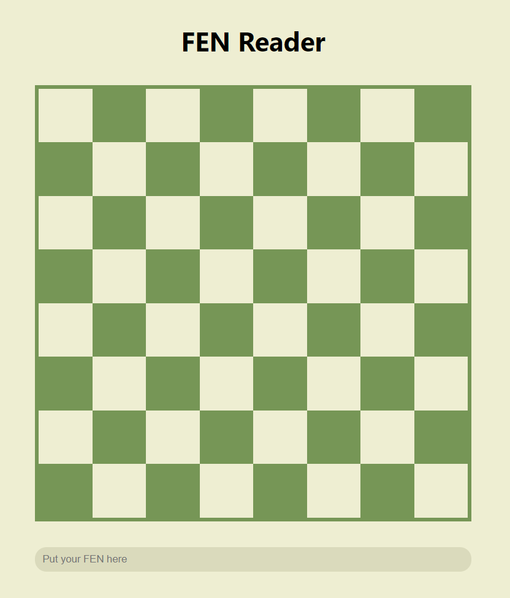
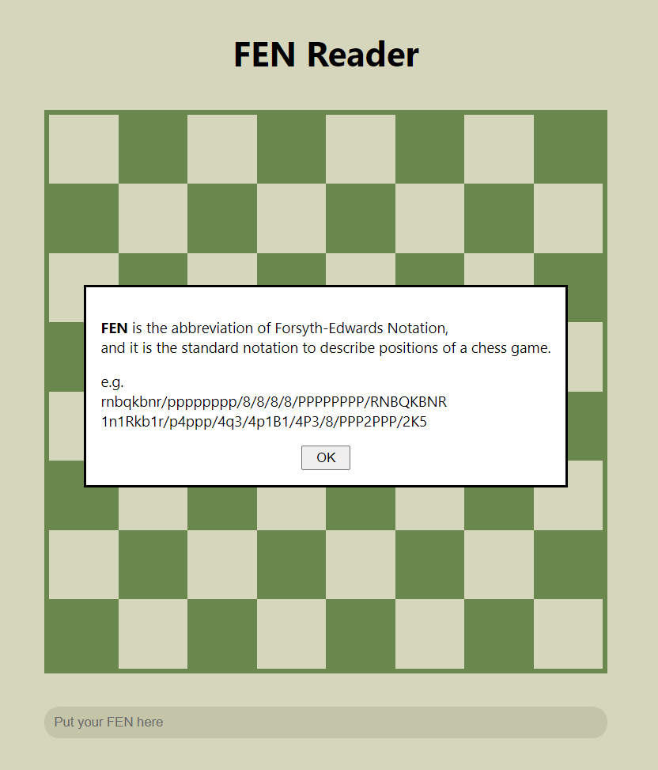
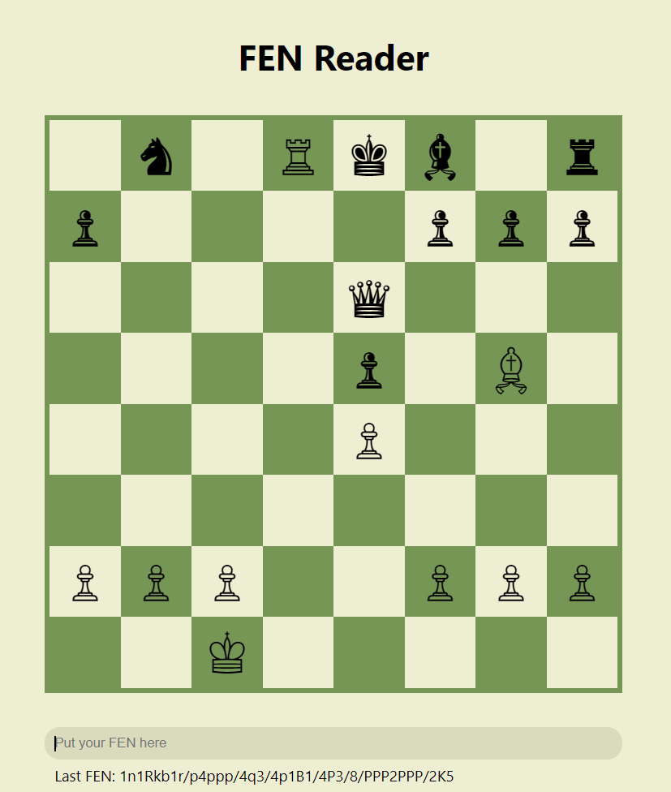

# FEN-reader

## Table of contents
* [General info](#general-info)
* [Technologies](#technologies)
* [Features](#features)
* [Screenshots](#screenshots)

## General info
FEN is the abbreviation of Forsyth-Edwards Notation and it is the standard notation to describe positions of a chess game.
This program is decoding FENs to chess positions.
	
## Technologies
Project is created with:
* JavaScript
* CSS3
* HTML5

## Features
* Decode FEN to chess position

## Screenshots
#### User Interface

#### Info about FEN

#### The final result

